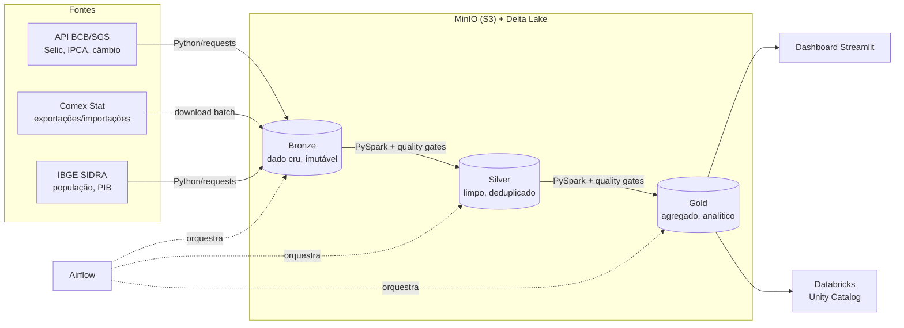

# Lakehouse Economia BR

Pipeline de dados ponta a ponta processando dados públicos da economia brasileira
(comércio exterior, indicadores macro e demografia) com **PySpark + Delta Lake**,
em arquitetura medallion, orquestrado com Airflow, com testes automatizados,
gates de qualidade e dashboard Streamlit — portável para Databricks.

> Pipeline completo bronze → silver → gold, orquestrado, testado e com dado
> real de 2016-2025. Falta preencher os números do tuning e um ADR de
> qualidade de dados.

## Arquitetura



## Por que essas escolhas

| Decisão | Motivo |
|---|---|
| **Medallion (bronze/silver/gold)** | Bronze preserva o dado cru pra reprocessar sem bater na fonte; cada camada tem contrato claro |
| **Delta Lake** | ACID, `MERGE` idempotente, time travel — resolve dado contaminado/reprocessamento, problema real de produção |
| **MinIO** | API idêntica ao S3, custo zero local; trocar pra S3/ADLS real é mudar 3 configs |
| **Ingestão sem Spark** | API de poucos MB é problema de I/O; Spark entra onde há escala (Comex Stat: dezenas de milhões de linhas) |
| **Duas estratégias de idempotência** | BCB usa `MERGE` (revisão linha a linha), Comex/IBGE usam `replaceWhere` (unidade de reprocessamento é o ano inteiro) — cada dataset pede a ferramenta certa, não uma receita única |
| **Retry só para falha transiente** | Quality gate falha com exit code próprio; o DAG traduz em `AirflowFailException` (sem retry). Dado ruim é determinístico — tentar de novo em 10min encontra o mesmo problema |
| **Quality gates hand-rolled** | Checks (não-nulo, duplicata, range) rodam ANTES de gravar silver/gold e falham o job de propósito — sem lib pesada (Great Expectations), só o necessário pro escopo do projeto |

Decisões detalhadas em [`docs/decisions/`](docs/decisions/):
[ADR-001](docs/decisions/adr-001-delta-lake.md) (Delta Lake) ·
[ADR-002](docs/decisions/adr-002-idempotencia.md) (MERGE vs replaceWhere) ·
[ADR-003](docs/decisions/adr-003-databricks-portabilidade.md) (portabilidade Databricks).

Metodologia e números de performance em [`docs/tuning.md`](docs/tuning.md).

## Como rodar

```bash
cp .env.exemple .env
make up            # sobe minio + spark (2 workers) + app
make ingest-bcb    # ingesta séries do BCB -> bronze
make ingest-ibge  ANOS="2016 2017 2018 2019 2020 2021 2022 2023 2024 2025"
make ingest-comex ANOS="2016 2017 2018 2019 2020 2021 2022 2023 2024 2025"
make silver       ANOS="2016 2017 2018 2019 2020 2021 2022 2023 2024 2025"
make gold
make dashboard      # http://localhost:8501
```

Ou orquestrado: liga a DAG `lakehouse_pipeline` na UI do Airflow
(`make airflow-ui`, senha do admin em `make airflow-password`).

Backfill de anos anteriores — os jobs são idempotentes, então é seguro:

```bash
docker compose exec airflow airflow dags backfill \
    -s 2020-01-01 -e 2023-12-31 lakehouse_pipeline
```

Rodar a suíte de testes (não precisa de MinIO real — os testes redirecionam
a leitura/escrita Delta pra um diretório local temporário):

```bash
docker compose exec app python -m pytest tests/ -v
```

UIs: Spark Master em `localhost:8080`, console MinIO em `localhost:9001`,
dashboard Streamlit em `localhost:8501`.

## Estrutura

```
src/
  ingestion/     bcb_sgs.py, comex_stat.py, ibge_sidra.py  (raw -> bronze)
  transform/     bronze_to_silver.py, ibge_to_silver.py, silver_to_gold.py
  quality/       expectations.py  (gates de qualidade: not_null, unique, range)
  common/        config.py (Settings), spark_session.py (get_spark())
  publish/       databricks_publish.py  (gold -> Unity Catalog)
dashboards/      app.py  (Streamlit: exportação x câmbio x população/PIB per capita)
tests/           espelha src/ingestion e src/transform, 27 testes (pytest + chispa)
docs/decisions/  ADRs
```

## Roadmap

- [x] Ambiente Docker + ingestão BCB SGS → bronze
- [x] Comex Stat no bronze (dado grande de verdade, 2016-2025)
- [x] IBGE SIDRA (população + PIB municipal) no bronze
- [x] Bronze → Silver com Delta (`MERGE` / `replaceWhere` idempotente)
- [x] Silver → Gold (exportação x câmbio x população/PIB per capita, por UF/ano)
- [x] Testes (pytest + chispa) — 27 testes cobrindo ingestão e transformação
- [x] Data quality gates (falham o job antes de gravar silver/gold com dado ruim)
- [x] Dashboard Streamlit
- [x] Portabilidade Databricks (`RUNTIME_ENV`, publish job, Unity Catalog)
- [x] Orquestração com Airflow + backfill
- [ ] ADR de estratégia de qualidade de dados
- [ ] Tuning: harness pronto (`make benchmark`), faltam os números medidos em [`docs/tuning.md`](docs/tuning.md)
