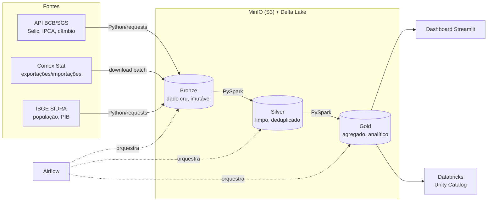

# Lakehouse Economia BR

Pipeline de dados ponta a ponta processando dados públicos da economia brasileira
(comércio exterior, indicadores macro e demografia) com **PySpark + Delta Lake**,
em arquitetura medallion, orquestrado com Airflow e portável para Databricks.

> Projeto em construção — acompanhando o roadmap abaixo.

## Arquitetura



## Por que essas escolhas

| Decisão | Motivo |
|---|---|
| **Medallion (bronze/silver/gold)** | Bronze preserva o dado cru pra reprocessar sem bater na fonte; cada camada tem contrato claro |
| **Delta Lake** | ACID, `MERGE` idempotente, time travel — resolve dado contaminado/reprocessamento, problema real de produção |
| **MinIO** | API idêntica ao S3, custo zero local; trocar pra S3/ADLS real é mudar 3 configs |
| **Ingestão sem Spark** | API de poucos MB é problema de I/O; Spark entra onde há escala (Comex Stat: dezenas de milhões de linhas) |

Decisões detalhadas em [`docs/decisions/`](docs/decisions/).

## Como rodar

```bash
cp .env.example .env
make up          # sobe minio + spark (2 workers) + app
make ingest-bcb  # ingesta séries do BCB -> bronze
make smoke       # Spark lê o bronze e mostra amostra
```

UIs: Spark Master em `localhost:8080`, console MinIO em `localhost:9001`.

## Roadmap

- [x] Passo 1 — Ambiente Docker + ingestão BCB SGS → bronze
- [x] Passo 2 — Comex Stat no bronze (dado grande de verdade)
- [x] Passo 3 — Bronze → Silver com Delta (`MERGE` idempotente)
- [ ] Passo 4 — Silver → Gold (joins e agregações analíticas)
- [ ] Passo 5 — Orquestração com Airflow + backfill
- [ ] Passo 6 — Tuning: AQE, skew, broadcast, números antes/depois
- [ ] Passo 7 — Testes (pytest + chispa) e data quality gates
- [ ] Passo 8 — Dashboard + camada Databricks + documentação final